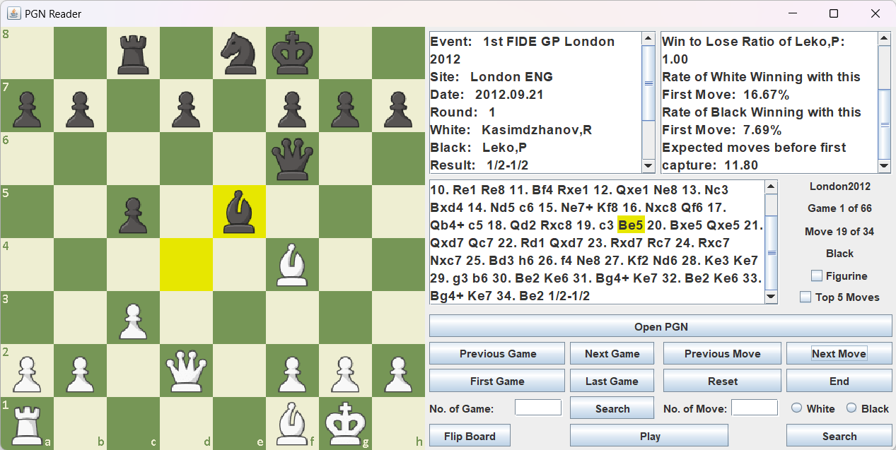

# PGN Reader



## Overview

This is a Java-based PGN (Portable Game Notation) chess game reader with a graphical user interface (GUI). It allows users to parse and view chess games stored in PGN format. The program provides an intuitive way to navigate through chess games and analyze moves.

## Usage

1. Clone the repository to your local machine:

   ```bash
   git clone https://github.com/mehdimhb/pgn-reader.git
   ```

2. Compile and run the Java program::

    ```bash
    cd pgn-reader
    javac Main.java
    java Main

    ```

## License

This project is licensed under the MIT License. See the [LICENSE](LICENSE) file for more information